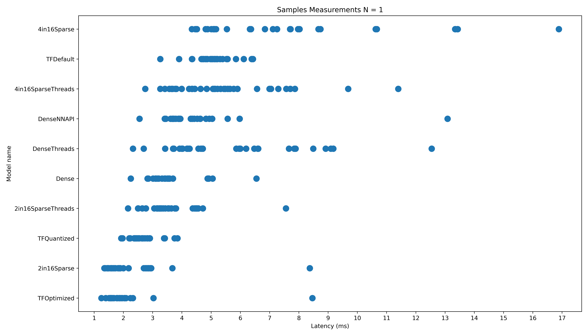
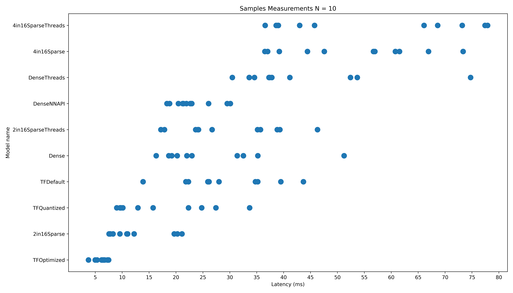
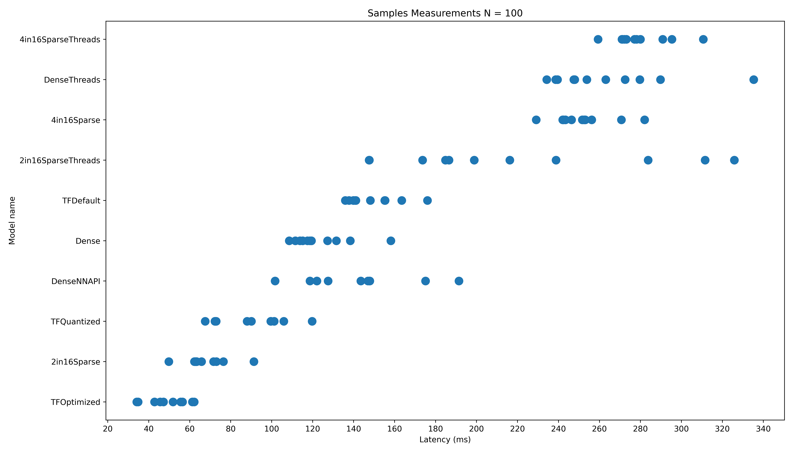
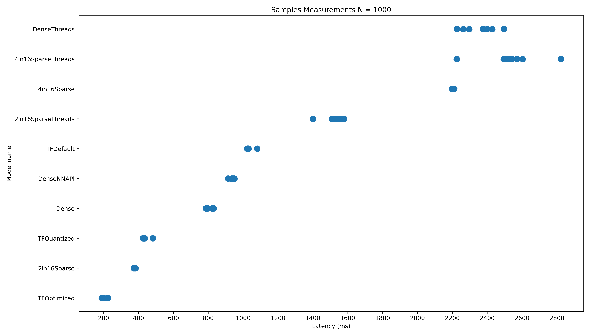
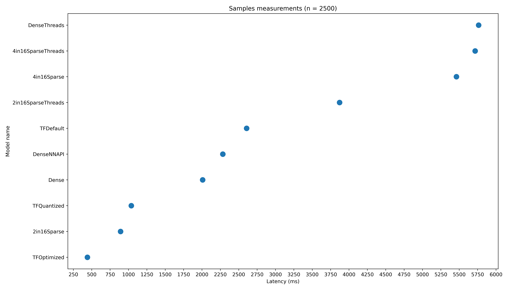
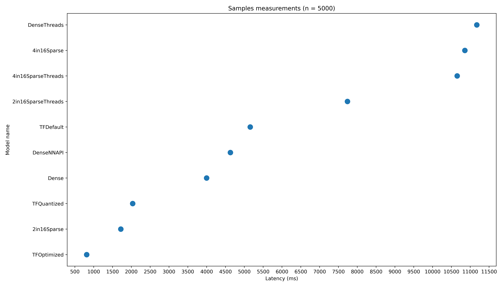
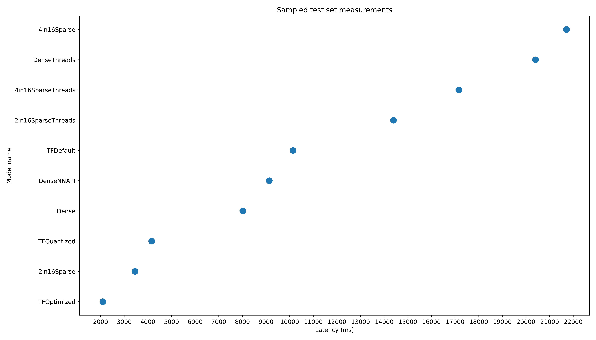
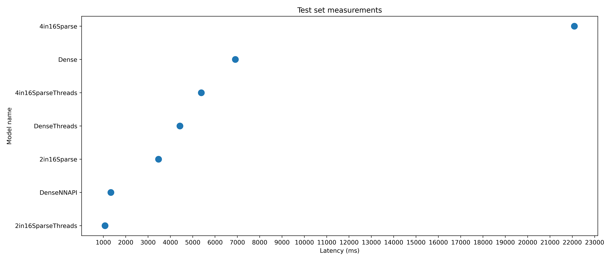

# Sparse Matrices
This repository contains implementations of matrix multiplication in C++ and CUDA for various matrix sparsity patterns.

## Google Pixel 7 Performance Test
The K in N sparse patter, in this case 4 in 16 and 2 in 16, was tested on a 5 layer MLP. Only the hidden layers of size 1024x1024 were sparsified, the output layer of size 10x1024 remained dense. The performance comparison of the sparsified networks, the dense network implemented in C++, the dense network implemented using the Android Neural Networks API and the dense network converted to TF Lite models can be see on the plots below. 

The *Samples Measurements* plots show the time it takes to predict N times the same sample calling the model from Kotlin code. The *Sampled Test Set Measurements* plot shows the time it takes to predict the whole upscaled MNIST test set sample by sample from Kotlin. The *Test Set Measurements* plot shows how long it takes to predict the whole upscaled MNIST test set in a matrix form, i.e. with a single call from Kotlin.

