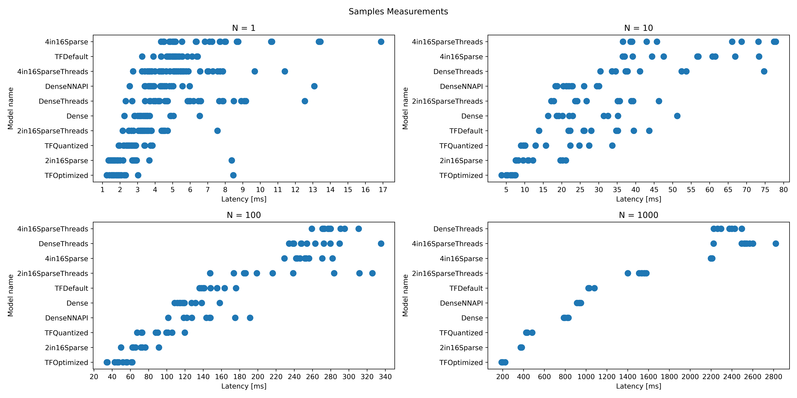
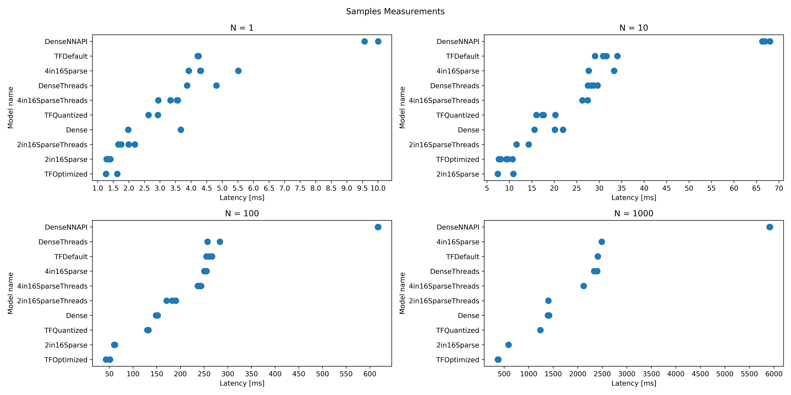
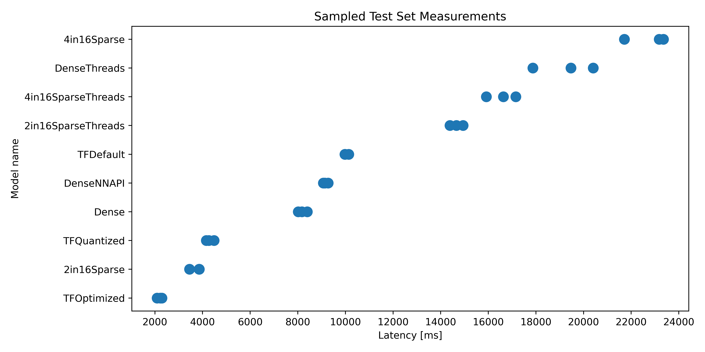
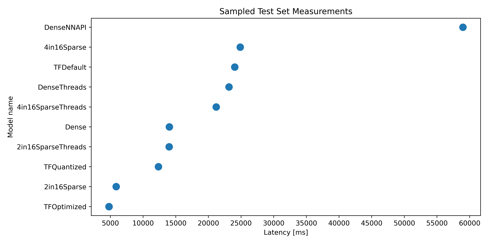
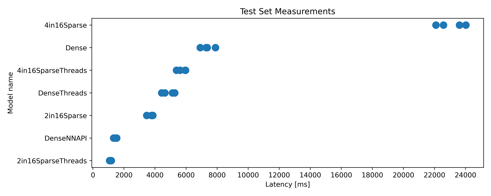
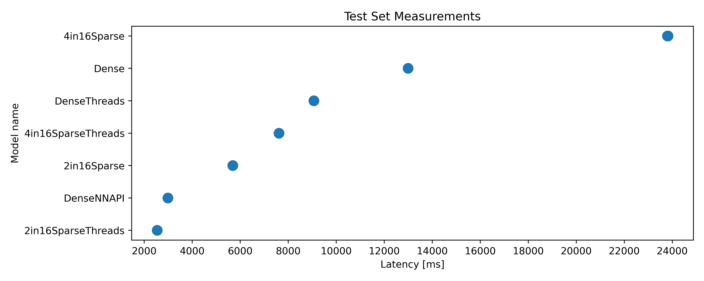

# Sparse Matrices
This repository contains implementations of matrix multiplication in C++ for various matrix sparsity patterns. See more in the [report.pdf](./report.pdf).

## Performance Analysis
The K in N sparse patter, in this case 4 in 16 and 2 in 16, was tested on a 5 layer MLP (with ReLu activation and bias addition fused with the matrix multiplication). Only the hidden layers of size 1024x1024 were sparsified, the output layer of size 10x1024 remained dense. The performance comparison of the sparsified networks, the dense network implemented in C++, the dense network implemented using the Android Neural Networks API and the dense network converted to TF Lite models can be see on the plots below. 

The *Samples Measurements* plots show the time it takes to predict N times the same sample calling the model from Kotlin code. The *Sampled Test Set Measurements* plot shows the time it takes to predict the whole upscaled MNIST test set sample by sample from Kotlin. The *Test Set Measurements* plot shows how long it takes to predict the whole upscaled MNIST test set in a matrix form, i.e. with a single call from Kotlin.

The optimized Tensorflow Lite model (TFLite model) is often the best performing model. The most likely reasons why it is the case are: 
* the TFLite model has access to special instructions, which enable it to use HW support, i.e. tensor cores,
* the sparse matrix multiplication is not yet optimized for cache access.

### Plots
|  |  |
|:--:| :--: |
| Google Pixel 7 | Xiaomi Redme Note 9 Pro |

|  |  |
|:--:| :--: |
| Google Pixel 7 | Xiaomi Redme Note 9 Pro |

|  |  |
|:--:| :--: |
| Google Pixel 7 | Xiaomi Redme Note 9 Pro |

